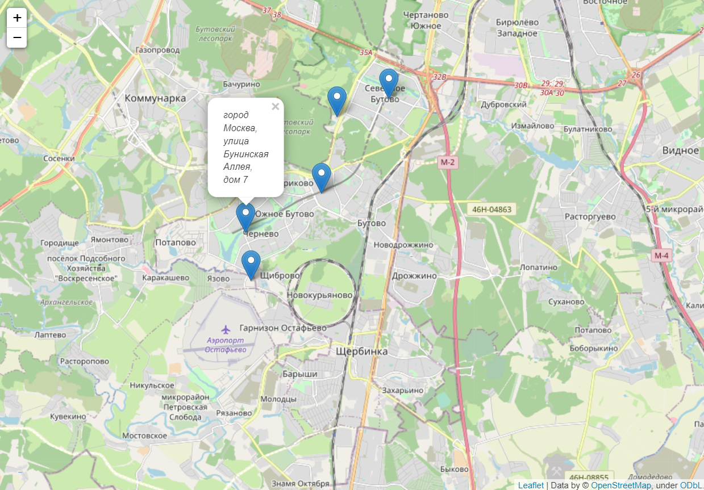

# Создание карты с ближайшими кафе вокруг вас. (Москва)

## Запуск проекта:

1. Скачайте проект:<br>
```commandline
git clone https://github.com/NankuF/coffee_map.git
```
2. Создайте виртуальное окружение:<br>
```commandline
python -m venv venv
```
3. Активируйте виртуальное окружение:<br>
Windows<br>
```commandline
. .\venv\Scripts\activate
```
Linux<br>
```commandline
. ./venv/bin/activate
```
4. Установите зависимости:<br> 
```commandline
cd coffee_map
```
```commandline
pip install -r requirements.txt
```
5. Создайте файл `.env` и добавьте в него ключ апи полученный в Яндексе
   (https://developer.tech.yandex.ru/services/):
```commandline
YA_APIKEY = 'ваш ключ апи к сервису Яндекса'
```
6. Запустите код в консоли:<br>
```commandline
python main.py
```
7. Перейдите в браузере по адресу:<br>
```commandline
http://127.0.0.1:5000
```
8. Выберите подходящее кафе:<br>

